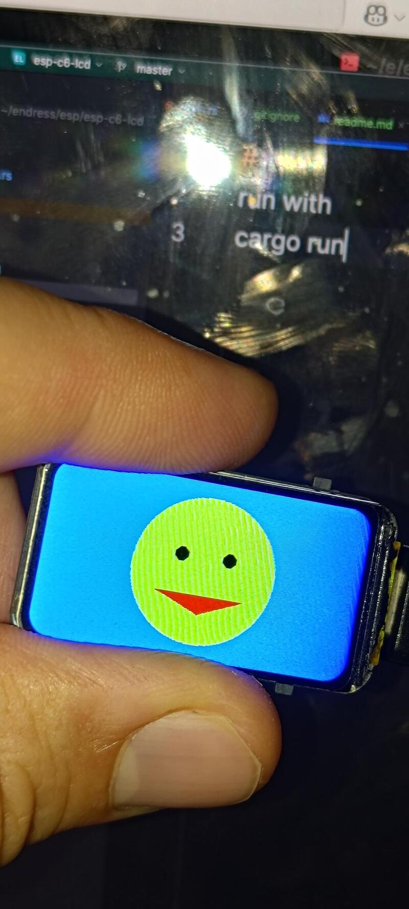

# WAT 
esp32 c6 with LCS waveshare or spotpear
https://spotpear.com/wiki/ESP32-C6-1.47-inch-LCD-Display-Screen-LVGL-SD-WIFI6-ST7789.html#VScode
or
https://www.waveshare.com/wiki/ESP32-C6-LCD-1.47


```bash
#run with 
cargo install just
just resizeImages
just release

# (or )
cargo run --release
```
# ESP-C6 LCD Demo

This project demonstrates using the **ESP32-C6** with an **ST7789 1.47" LCD display** and Rust (`esp-hal`, `mipidsi`, and `embedded-graphics`).

## Features
- Initializes the ST7789 display over SPI
- Draws simple graphics (triangle / smiley)
- Shows logging output via `esp-println`
- Configurable backlight pin
- Uses `esp_bootloader_esp_idf::esp_app_desc!()` for bootloader compatibility

## Hardware
- **Board**: Spotpear ESP32-C6 with 1.47" LCD (ST7789)
- **Connections**:
  - SCLK → GPIO10
  - MOSI → GPIO9
  - DC   → GPIO22
  - RST  → GPIO20
  - CS   → GPIO15
  - BL   → GPIO0

## Build & Flash
Make sure you have Rust ESP setup (`espup` + `espflash`):

```bash
# build and flash with monitor
cargo build --release
espflash flash --monitor --chip esp32c6 target/riscv32imac-unknown-none-elf/release/esp-c6-lcd
```

Or run directly:
```bash
cargo run --release
```

## Output
- The display will clear to black and draw a red triangle as a test.
- Logs appear on the serial monitor:
  ```
  INFO - Hello world!
  ```

## Notes
- If the display stays black, check:
  - Pin assignments in `main.rs`
  - Orientation / offsets
  - That backlight (BL) pin is set high
